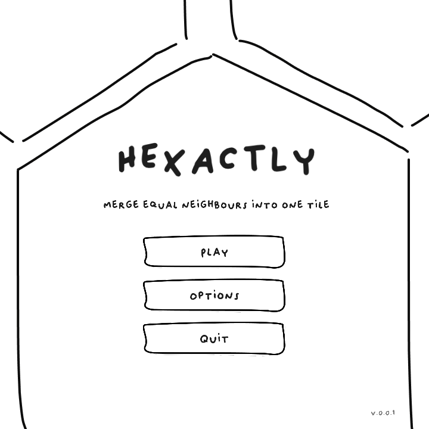
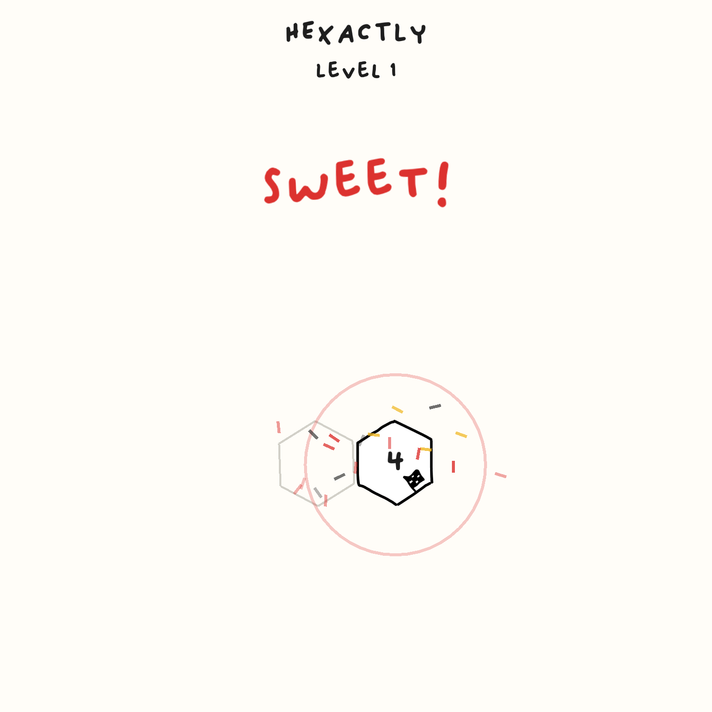

-----------------------------------

## Getting Started with this template

### Windows: Visual Studio

- After extracting the zip, the parent folder `raylib-game-template` should exist in the same directory as `raylib` itself.  So, your file structure should look like this:
    - Some parent directory
        - `raylib`
            - the contents of https://github.com/raysan5/raylib
        - `raylib-game-template`
            - this `README.md` and all other raylib-game-template files
- If using Visual Studio, open projects/VS2022/raylib-game-template.sln
- Select on `raylib_game` in the solution explorer, then in the toolbar at the top, click `Project` > `Set as Startup Project`
- Now you're all set up!  Click `Local Windows Debugger` with the green play arrow and the project will run.

#### Linux

When setting up this template on linux for the first time, install the dependencies from this page:
([Working on GNU Linux](https://github.com/raysan5/raylib/wiki/Working-on-GNU-Linux))

You can use this templates in a few ways: using Visual Studio, using CMake, or make your own build setup. This repository comes with Visual Studio and CMake already set up.

Chose one of the follow setup options that fit in you development environment.

### CLI: Makefile

```sh
mkdir ~/raylib-gamejam && cd ~/raylib-gamejam
git clone --depth 1 --branch 6.0 https://github.com/raysan5/raylib
make -C raylib/src
git clone https://github.com/$(User Name)/$(Repo Name).git
cd $(Repo Name)
make -C src
src/raylib_game
```

This template has been created to be used with raylib (www.raylib.com) and it's licensed under an unmodified zlib/libpng license.

_Copyright (c) 2014-2026 Ramon Santamaria ([@raysan5](https://github.com/raysan5))_
-----------------------------------

## Hexactly

COOL IMAGE WILL COME HERE 
<!-- ") -->

### Description

Hexactly is a cozy, hand-drawn merge puzzle played on a hexagonal grid. Combine two
equal neighbouring tiles and they double. Your goal: chain your merges to reach the target number
on the goal tile and solve each level before you run out of moves! 

### Features

 - Puzzle twists: **stones** (inert blockers), **walls** (blocked edges), **portals** (link two far cells) and **cursed** tiles (unlock when you merge beside them).
 - Move-limited levels that must be solved in the tiles you're given.
 - Saved progress and a level-select map that unlocks as you complete levels.

### Controls

Mouse:
 - **Click** a tile, then an equal neighbour, to merge them
 - **Drag** a tile onto an equal neighbour to merge (guide line shows the link)
 - Click the on-screen **info**, **pause** and **undo** buttons
 - **Scroll wheel** to move through the level-select grid

Keyboard:
 - **U** / **Z** — undo the last merge
 - **R** — restart the level
 - **Esc** / **Backspace** — pause (Resume / Restart / Levels)
 - **Space** / **Enter** — skip the win celebration
 - **Arrows** / **Tab** — move menu focus, **Enter** to confirm

### Screenshots





### Developers

 - Manuel Sánchez (Barkhalla Studios) - Code, Design, Audio

### Links

 - YouTube Gameplay: $(YouTube Link)
 - itch.io Release: [https://barkhallastudios.itch.io/hexactly](https://barkhallastudios.itch.io/hexactly)

### License

This project sources are licensed under an unmodified zlib/libpng license, which is an OSI-certified, BSD-like license that allows static linking with closed source software. Check [LICENSE](LICENSE) for further details.


Music (in-my-happy-space.wav):
- Contains music (c) 2025 Retro Indie Josh (https://retroindiejosh.itch.io). Licensed under Creative Commons Attribution 4.0 International

*Copyright (c) 2026 Manuel Sánchez GitHub: manusanchez2*
